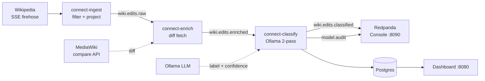

# Wikipedia Edit-Triage Agent

[](https://github.com/takabayashi/agentic-rd/actions/workflows/ci.yml)

A locally-runnable system that ingests the Wikipedia recent-changes firehose,
triages each edit with a multi-step LLM reasoning loop (Redpanda Connect +
Ollama), and serves the results on a live dashboard. A personal project to learn
Redpanda Connect and a staged, multi-step local-LLM pipeline end to end.

## How it works

Three Redpanda Connect services hand off edits over compacted Kafka topics, and a
read-only web app serves the results from Postgres:



- **ingest** filters the firehose to English-Wikipedia article edits and projects
  a clean schema.
- **enrich** fetches each edit's real diff (the actual evidence) from MediaWiki.
- **classify** runs a cheap first-pass LLM call, escalates only the ambiguous
  ones to a second pass, then fan-outs to a topic, a Postgres UPSERT, and an audit
  topic.

The full rationale — tradeoffs, surprises, and where this breaks in production —
is in [`docs/writeup.md`](docs/writeup.md).

## Run

**From a fresh machine** (clones the repo, then starts everything):

```bash
curl -fsSL https://raw.githubusercontent.com/takabayashi/agentic-rd/main/install.sh | bash
```

**From a clone:**

```bash
./start.sh          # self-healing bootstrap (or: make start)
docker compose up   # the raw command also works (or: make up)
```

`start.sh` verifies Docker is running, seeds `.env` on first run, auto-detects a
host-native Ollama on Apple Silicon, brings the stack up, waits for the dashboard
to report healthy, and opens it. It's idempotent — safe to re-run.

Any of these starts Postgres (schema + seed applied on first run), the web app,
the Redpanda broker + Console, Ollama, and the three Connect pipelines. Then open:

- **Dashboard** → <http://localhost:8080>
- **Redpanda Console** → <http://localhost:8090>

The dashboard fills with **live** classified edits once the pipeline is running
(it shows the seeded rows in [`db/seed.sql`](db/seed.sql) until then).

> **Memory / environment.** The full stack needs a Docker VM with **≥ 4 GB**.
> Docker Desktop defaults are the reference environment; a tiny ~1.9 GB Colima VM
> will OOM-kill redpanda. On Apple Silicon, run Ollama on the host — the
> containerized model can crash under Colima (see
> [`docs/pipeline.md`](docs/pipeline.md)).

## Documentation

| Doc | What's in it |
|-----|--------------|
| [`docs/writeup.md`](docs/writeup.md) | Design notes: tradeoffs, surprises, and where this breaks in production |
| [`docs/requirements.md`](docs/requirements.md) | Design overview: problem, users, scope, constraints |
| [`docs/decisions.md`](docs/decisions.md) | Decision log (why each choice was made), by phase |
| [`docs/TODO.md`](docs/TODO.md) | Build log: the phases I built this in, with acceptance criteria |
| [`docs/architecture.html`](docs/architecture.html) | Visual architecture diagrams |
| [`docs/pipeline.md`](docs/pipeline.md) | The Connect pipeline: ingest, enrich, classify, sink |
| [`docs/dashboard.md`](docs/dashboard.md) | Dashboard, JSON API, and health/readiness endpoints |
| [`docs/database.md`](docs/database.md) | Postgres schema, seeds, and the UPSERT rationale |
| [`docs/observability.md`](docs/observability.md) | Metrics, structured logs, readiness |
| [`docs/configuration.md`](docs/configuration.md) | Environment variables, secrets, and CI |
| [`docs/development.md`](docs/development.md) | Make targets, testing, and repo layout |

## Ports

| Port | Service |
|------|---------|
| `8080` | Triage dashboard (web app) |
| `8090` | Redpanda Console |
| `4195` | `connect-classify` Prometheus metrics |
