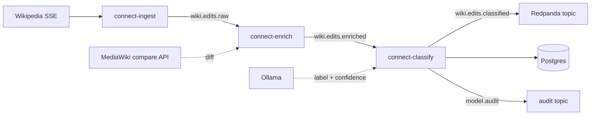

# Pipeline & classification

[← Back to README](../README.md)

The pipeline is three [Redpanda Connect](https://docs.redpanda.com/redpanda-connect/)
services that hand off edits via compacted topics (key = `rev_id`). Topics are
the inter-stage protocol — each service is independently restartable and
replayable.



| Service | Config | Role |
|---------|--------|------|
| `connect-ingest` | [`connect/ingest.yaml`](../connect/ingest.yaml) | SSE → filter/project → `wiki.edits.raw` |
| `connect-enrich` | [`connect/enrich.yaml`](../connect/enrich.yaml) | diff fetch → `wiki.edits.enriched` |
| `connect-classify` | [`connect/classify.yaml`](../connect/classify.yaml) | Ollama agent + sink fan-out |

Watch the pipelines:

```bash
make logs-connect      # all three services
make consume-raw       # projected edits (includes parent_rev)
make consume-enriched  # edits with diff text
```

## Ingest

[`connect/ingest.yaml`](../connect/ingest.yaml) consumes the
[Wikipedia recent-changes SSE firehose](https://stream.wikimedia.org/v2/stream/recentchange)
with `http_client` + `stream.enabled` + the `lines` scanner. SSE frames look
like `data: {…}`; we keep only `data:` lines, strip the prefix, and
`parse_json().catch(deleted())` so heartbeats (`:ok`) and any non-JSON **fail
closed**. We drop bots, non-`edit` events, and non-article namespaces, and scope
to **English Wikipedia** (`server_name == "en.wikipedia.org"`). The projected
payload includes `parent_rev` for the enrich stage (handoff fields live in JSON,
not metadata — Kafka drops metadata between services).

## Enrich

[`connect/enrich.yaml`](../connect/enrich.yaml) consumes `wiki.edits.raw`,
**validates the inter-stage contract** (`schema_version == 1` and a present
`rev_id`), fetches each edit's diff from the MediaWiki compare API, and produces
`wiki.edits.enriched` with `diff` in the payload. Records that fail the contract
are routed to a **dead-letter** topic (`wiki.edits.dead_letter`, 24h retention)
via an output `switch` instead of being silently dropped, so malformed handoffs
are inspectable in Console rather than invisible.

Dedup is handled by compacted topic keys + the Postgres `rev_id` UPSERT; no
in-pipeline cache on this SSE source.

## Classify (diff-enriched, two-pass)

[`connect/classify.yaml`](../connect/classify.yaml) consumes
`wiki.edits.enriched` and runs the multi-step LLM agent: each edit is classified
by a **local Ollama model** through Connect `branch`es, then persisted to
Postgres and streamed to topics (see [Sink](#sink-topics-console--upsert)).

```bash
docker compose logs -f connect-classify   # classify + sink activity
make labels escalations                   # from classify logs
```

How it works:

- **Fetch the real diff (the actual evidence).** Handled in `connect-enrich`. The
  recentchange SSE event is only edit *metadata* — never the changed text. The
  enrich service fetches each edit's diff from the MediaWiki REST compare API,
  keeps only changed lines (`+` / `-` / `~`), truncates to ~4 KB, and puts `diff`
  in the enriched topic payload. The fetch fails **closed** (empty diff,
  classification still proceeds on metadata). Rate limit: `wiki_api`, 10/s.
- **Content gate (avoid dumb model calls).** Before any inference, a `switch`
  skips edits with no usable evidence: if the **cleaned** diff (whitespace
  collapsed) is shorter than `DIFF_MIN_CHARS` **and** `|size_delta|` is below
  `BLANKING_MIN_DELTA`, the edit is stamped `label=unclear`, `confidence=0`,
  `reason=empty_diff` with **no** model call (and so no escalation either). The
  `size_delta` guard deliberately exempts blanking / large removals (empty diff
  but a big negative delta) so that vandalism case still reaches the model. Gated
  rows aren't dropped — they appear on the dashboard tagged "skipped" and can be
  corrected later by the `rev_id` UPSERT. Model-classified rows carry
  `reason=classified`.
- **Two passes (cost vs. accuracy).** Pass-1 classifies every survivor from the
  diff + metadata. A confidence `switch` then escalates only the ambiguous ones —
  `confidence < CONFIDENCE_THRESHOLD` (default `0.7`) **or** `label == unclear` —
  to a second, more rigorous pass that re-reads the same diff with a detailed
  per-label rubric, the editor identity (an anonymous IP is a vandalism signal),
  and the first-pass result for self-critique. Confident pass-1 rows skip the
  second model call (`escalated = false`); escalated rows are stamped
  `escalated = true`. Lower `CONFIDENCE_THRESHOLD` to escalate less; raise it to
  escalate more.
- **Retries on bad output (and an unreachable model).** We deliberately *do not*
  run an in-pipeline retry loop. A malformed/empty reply — or a record the
  `branch` couldn't classify at all because the model was unreachable (Connect
  skips `result_map` when a branch's inner call fails) — falls back to `unclear`
  via a fail-safe default, so a row is never emitted with an empty label and the
  escalation `switch` never compares a null confidence. A later, more confident
  pass corrects the row via the Postgres UPSERT. On a noisy firehose this keeps
  latency/cost bounded and self-corrects, which we prefer over blocking retries
  (we'd flip if classifications were authoritative).
- **Local LLM via Ollama.** A pinned `ollama` service serves the model; a
  one-shot `ollama-pull` preloads it on startup, and `connect-classify` waits for
  that to complete so there's no cold-start "model not found" race. First run
  downloads the model (`llama3.2`, ~2 GB); later runs reuse the cached `ollama`
  volume. Ingest and enrich start without waiting on Ollama.
- **Change the model.** Set `OLLAMA_MODEL` (any Ollama model name) in `.env`; it
  is pulled automatically. `OLLAMA_ADDRESS` points `connect-classify` at the
  server.
- **Memory vs. quality.** The model loads entirely in RAM inside the Docker VM,
  so the VM needs more memory than the model size: `llama3.2` (~2 GB) wants
  roughly **4 GB+** allocated to Docker (Docker Desktop defaults are fine; with
  Colima use `colima start --memory 4` or more). On a tightly constrained VM you
  can drop to a **low-memory fallback** — `qwen2.5:1.5b` (~1 GB) or `qwen2.5:0.5b`
  (~0.4 GB) — but these classify noticeably worse (they over-label `vandalism`),
  so prefer `llama3.2` whenever the memory is available.
- **Apple Silicon / Colima → use host Ollama.** Docker can't pass through the Mac
  GPU, so the containerized Ollama runs CPU-only, and on an arm64 Colima VM the
  `ollama/ollama` image can crash during inference (a virtualization/cgo issue,
  not a pipeline bug). The reliable, fast path on a Mac is to run Ollama natively
  on the host and point Connect at it:

```bash
brew install ollama && ollama serve   # native, GPU-accelerated
ollama pull llama3.2
OLLAMA_ADDRESS=http://host.docker.internal:11434 docker compose up
```

  Connect services already map `host.docker.internal`, so only `OLLAMA_ADDRESS`
  needs to change. The containerized Ollama remains the default so
  `docker compose up` is self-contained on platforms that support it (Docker
  Desktop, Linux).
- **`branch` keeps the record intact.** `request_map` sends only the fields that
  inform a label (title, comment, `size_delta`, and the diff); `ollama_chat`
  returns JSON (`response_format: json`, `temperature: 0`); `result_map` grafts
  `{label, confidence}` back onto the original record rather than overwriting it.
  Both passes use this same pattern.
- **Robust, crash-safe parse.** We extract the first `{...}` block from the model
  reply (handles any prose around it), fall back to `{}` on failure, normalize
  the label (`trim().lowercase()`) to the enum — anything unknown or empty becomes
  `unclear` — and coerce `confidence` to a number clamped to `[0,1]`. A malformed
  or empty reply yields a valid `unclear` row instead of crashing. The identical
  parse is applied in both passes ([`connect/lib/classification.blobl`](../connect/lib/classification.blobl)).
- **Security.** Output is constrained to the fixed enum
  (`vandalism|substantive|trivia|unclear`) in both passes, so prompt-injection in
  the attacker-controlled title/comment/diff can't change system behavior; the
  classification is advisory only. No edit data is sent to any third-party model
  (inference is local); the only outbound calls are the public Wikipedia SSE feed
  and the read-only diff fetch (which sends just revision ids).

## Sink: topics, Console & UPSERT

`connect-classify` ends with a `broker` fan-out (in
[`connect/classify.yaml`](../connect/classify.yaml)) to three destinations:

- **`wiki.edits.classified`** — Redpanda topic, keyed by `rev_id`, `zstd`,
  batched: the stream of classified edits. The topic is **compacted**, so it
  keeps the last value per `rev_id` (matching the UPSERT's last-write-wins).
- **Postgres `classified_edits`** via `sql_raw` **UPSERT**
  (`INSERT ... ON CONFLICT (rev_id) DO UPDATE`) — the dashboard's source. A row
  first written `unclear` on a cold-start/transient failure is corrected in place
  by a later, more confident pass; re-processing a `rev_id` updates the row
  instead of duplicating it. The SQL output is wrapped in `retry`, so a transient
  Postgres outage is retried, not fatal.
- **`model.audit`** — Redpanda topic, append-only, ~6h retention, `zstd`: one
  record per edit with both passes' raw model I/O
  (`{rev_id, model, ts, pass1{input, raw_response, label, confidence}, pass2|null}`)
  for replay / prompt-eval / drift inspection. Captured from branch metadata; it
  is *not* persisted to Postgres (a `model_calls` table sync is left for later).
  **Data/retention note:** these records embed the full prompts — including the
  attacker-controlled title/comment/diff — so they're untrusted content. The
  short time-retention (not compaction) bounds how long that text lives; for a
  real deployment, lengthen retention deliberately, restrict topic ACLs, and treat
  audit data as sensitive (scrub/encrypt as policy requires).

Browse the topics in **Console** at <http://localhost:8090>, or from the CLI:

```bash
make consume-raw N=3
make consume-enriched N=3
make consume-classified N=5
make consume-audit N=2
```

- **Routing.** Routing is handled by the confidence `switch` (routing ambiguous
  edits to the escalation pass) plus a single labeled topic (the `label` field) —
  a deliberate choice over topic-per-label.
- **Compression.** Producer-side `zstd` on the topic outputs (text JSON + wikitext
  diffs compress well), paired with batching for a better ratio; transparent to
  Console/consumers.

See [`writeup.md`](writeup.md) for the design tradeoffs behind the two-pass loop,
Connect-as-sink, and dedup choices.
